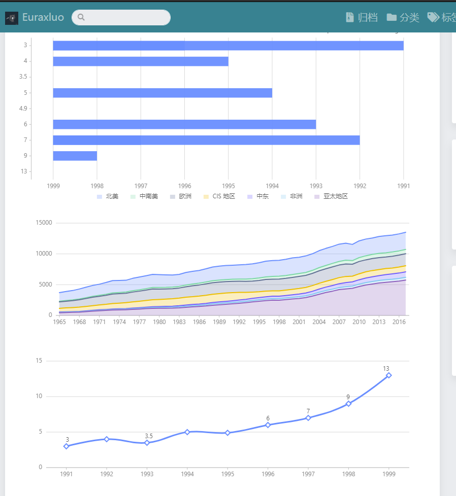
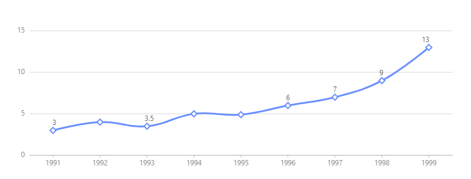
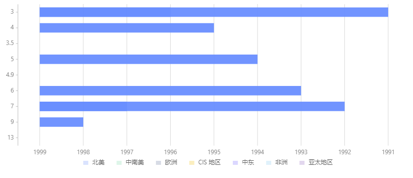

# hugo-g2plot

[](https://github.com/budparr/awesome-hugo)


## About

This is not a standalone theme. It is a [Hugo](https://gohugo.io) theme component providing a shortcode: `g2plot` to display [g2plot](https://antv-g2.gitee.io/zh) in your Hugo site. 



## Usage

1. Add the `hugo-g2plot` as a submodule to be able to get upstream changes later `git submodule add https://github.com/Euraxluo/hugo-g2plot.git themes/hugo-g2plot`
2. Add `hugo-g2plot` as the left-most element of the `theme` list variable in your site's or theme's configuration file `config.yaml` or `config.toml`. Example, with `config.yaml`:
    ```yaml
    theme: ["hugo-g2plot", "my-theme"]
    ```
    or, with `config.toml`,
    ```toml
    theme = ["hugo-g2plot", "my-theme"]
    ```
3. In your site, use the shortcode, this way:
    ```go
    
    // g2plot options goes here
    

    ```

    |  Name   | Type  | Default  | Description  |
    |  ----  | ----  | ----  | ----  |
    | type  | string | Bar | The type of g2plot  |
    | height  | number | 300 | The height of g2plot (px). |
    | width  | decimal | 100% | The width of g2plot responsive in window. |
    

## Example

```go

{
  "appendPadding": 32,
  "data": [
  { "year": '1991', "value": 3 },
  { "year": '1992', "value": 4 },
  { "year": '1993', "value": 3.5 },
  { "year": '1994', "value": 5 },
  { "year": '1995', "value": 4.9 },
  { "year": '1996', "value": 6 },
  { "year": '1997', "value": 7 },
  { "year": '1998', "value": 9 },
  { "year": '1999', "value": 13 },
],
  "xField": "year",
  "yField": "value",
  "label": {},
  "smooth": true,
  "lineStyle": {
    "lineWidth": 3,
  },
  "point": {
    "size": 5,
    "shape": 'diamond',
    "style": {
      "fill": "white",
      "stroke": "#5B8FF9",
      "lineWidth": 2,
    }
  }
}

```



```go

{
  "data": [
    { "year": "1991", "value": 3 },
    { "year": "1992", "value": 4 },
    { "year": "1993", "value": 3.5 },
    { "year": "1994", "value": 5 },
    { "year": "1995", "value": 4.9 },
    { "year": "1996", "value": 6 },
    { "year": "1997", "value": 7 },
    { "year": "1998", "value": 9 },
    { "year": "1999", "value": 13 },
  ],
  "xField": "year",
  "yField": "value",
}

```



## License

[hugo-g2plot](https://github.com/Euraxluo/hugo-g2plot) by [Euraxluo](https://github.com/Euraxluo) is under [GPL v3](https://github.com/Euraxluo/hugo-g2plot/blob/master/LICENSE) license.
